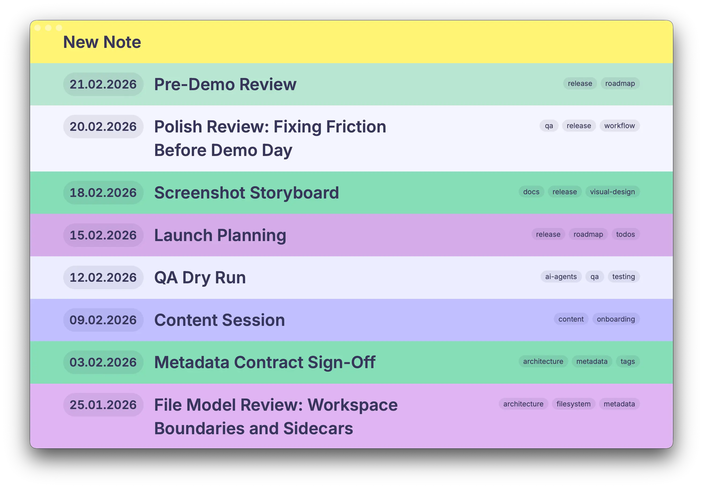
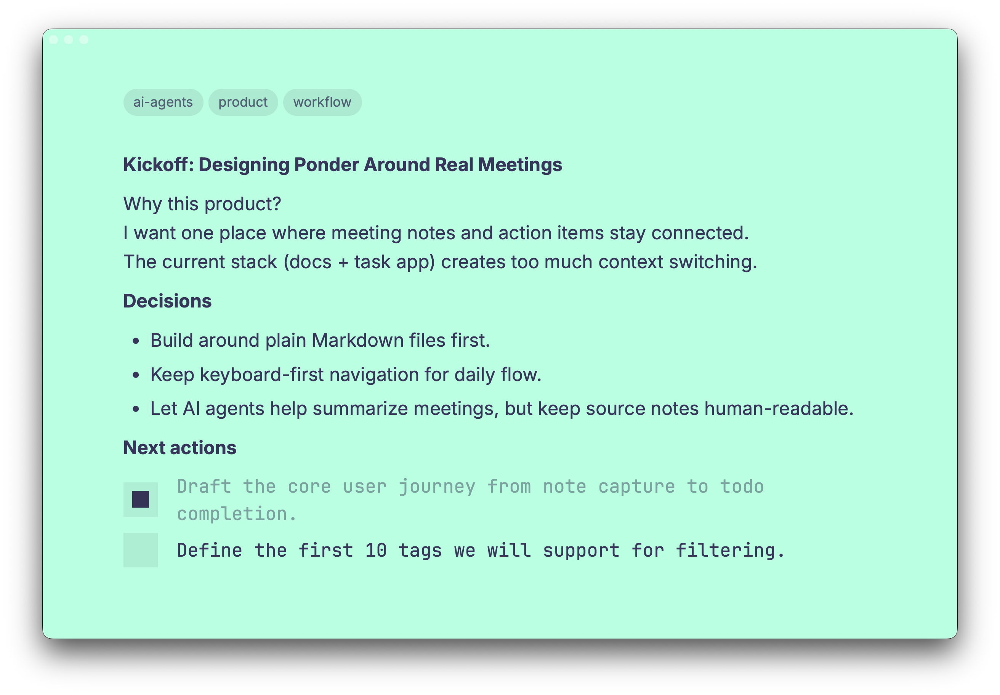
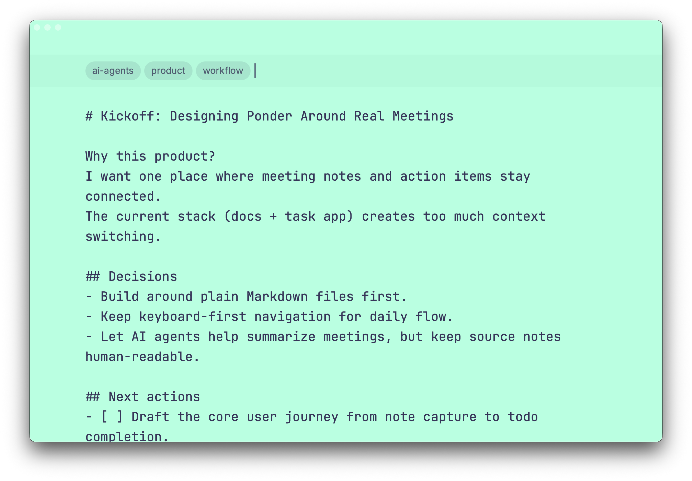
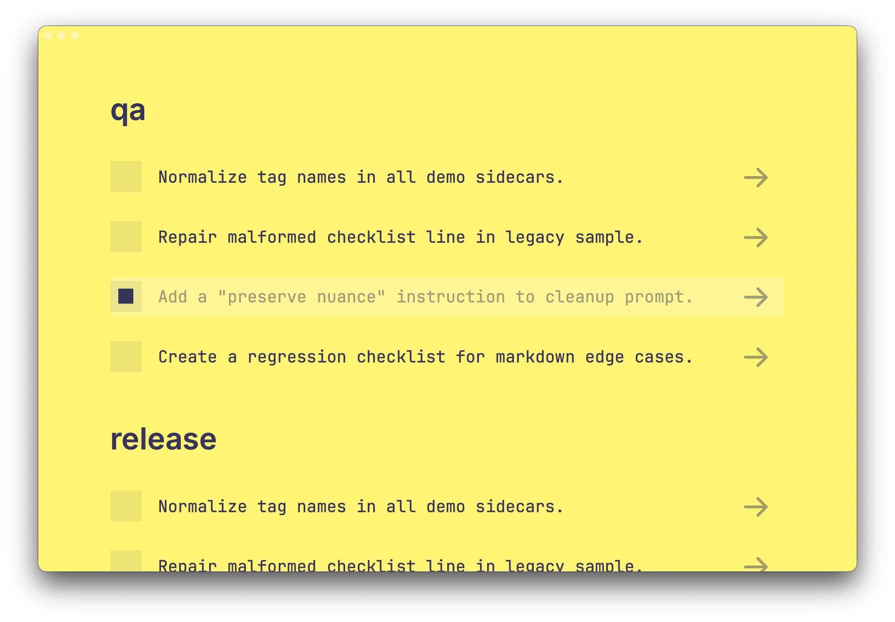

# Ponder

**Ponder is a fast, keyboard-friendly desktop app for people who keep their notes in Markdown files and want action items to stay connected to the original notes.**

Built for meeting notes, project logs, and personal knowledge workflows where plain files matter.



## Why Ponder

- Keep notes as plain `.md` files in your own folders.
- Switch between up to 9 workspace folders instantly.
- Search note titles and full content from one overview.
- Extract open todos from all notes and triage them in one screen.
- Toggle todos once and sync the checkbox back to the source note.

## What You Can Use It For

- Meeting protocols with action-item tracking.
- Team/project notebooks split by workspace (client, product, ops, etc.).
- Personal planning in Markdown without lock-in to a proprietary note format.
- "Inbox + execution" flow where notes and todos stay in sync.

## Feature Highlights

- **Markdown-first notes**: notes are root-level `.md` files in your workspace.
- **Auto title extraction**: note title is derived from the first line (Markdown-aware).
- **Autosave editor**: with retry logic when save fails.
- **Tagging system**: add tags as pills, with autocomplete from existing workspace tags.
- **Powerful search**:
  - Full-text matching across title + body preview.
  - Multi-term AND search.
  - `*` wildcard support (example: `meet*`).
  - Include/exclude tag filters (`#tag` and `#-tag`).
- **Todo aggregation**:
  - Parses Markdown checkboxes (`[ ]`, `- [ ]`, `[x]`).
  - Skips fenced code blocks and blockquotes.
  - Groups todos by note tags, ordered by recency.
- **Safe deletion**: deleting a note moves it to `deleted/` (no hard delete).
- **Workspace health + fallback**: detects missing/unreadable folders and supports fallback slot behavior.
- **Rebuild diagnostics**: writes and displays rebuild logs for note sidecar/index maintenance.







## Quick Start (Nix-first)

### Prerequisites

- Nix with flakes enabled
- macOS toolchain (Xcode Command Line Tools)

### Run in dev mode

```bash
nix develop
cd app
pnpm install
pnpm tauri dev
```

### Run tests

```bash
nix develop
cd app
pnpm test
```

### Build app bundle

From repo root:

```bash
./build-app.sh
```

Release build:

```bash
./build-app.sh --release
```

## Publishing a GitHub Release

1. Ensure versions are updated to the target release version in:
   - `app/package.json`
   - `app/src-tauri/Cargo.toml`
   - `app/src-tauri/tauri.conf.json`
2. Create and push a tag (example for version `1.0.0`):

```bash
git tag v1.0.0
git push origin v1.0.0
```

This triggers `.github/workflows/release.yml`, which builds and attaches macOS artifacts to a GitHub Release.

## Usage Workflow

1. Open **Workspaces** and assign a folder to a slot (1-9).
2. In **Overview**, create a note (`New Note`) or open an existing one.
3. Write in Markdown. Lines starting with `o ` are converted to `[ ]` when exiting edit mode.
4. Add tags in the editor to power filtering and todo grouping.
5. Open **Todos** to process open tasks across notes.

## Keyboard Shortcuts

Open the in-app shortcuts page with `h`, `?`, or the `?` button in the Overview search bar.

### Global (outside editor, when not typing)

- `o` -> Overview
- `w` -> Workspaces
- `t` -> Todos
- `n` -> New note
- `h` -> Shortcuts
- `?` -> Shortcuts

### Overview

- `1..9` -> Switch workspace slot
- `Arrow Up / Arrow Down` -> Move selection
- `Enter` -> Open selected note / create new note
- `d` (twice) -> Delete selected note (moves to `deleted/`)
- `c` -> Toggle compact list
- `Cmd/Ctrl + f` -> Focus search
- `Esc` -> Clear search and tag filters

### Search input (Overview)

- `Esc` -> Clear search + filters and blur
- `Backspace` (empty input) -> Remove last tag pill
- `Enter` with `#tag` or `#-tag` -> Create include/exclude tag pill
- `Space` with `#tag` or `#-tag` -> Create include/exclude tag pill

### Editor

- `Esc` -> Exit editor
- `e` -> Switch from preview to edit mode
- `o` then `Space` at line start (`o `) -> On exit, replaced with `[ ]` to create a todo

### Editor tag input + autocomplete

- `Enter` or `,` -> Commit tag pill
- `Backspace` (empty input) -> Remove last tag
- `Arrow Up / Arrow Down` -> Navigate autocomplete
- `Tab` or `Enter` -> Accept autocomplete selection
- `Esc` -> Close autocomplete

### Editor preview todo rows

- `Enter` -> Toggle todo
- `Arrow Up / Arrow Down` -> Move todo-row focus

### Todos

- `Arrow Up / Arrow Down` -> Move selection
- `Space` -> Toggle todo
- `Enter` -> Open source note
- `Esc` -> Back to overview

## Workspace/Data Model

For each workspace folder:

- Notes live at root as timestamp-based files (for example `1739612345678.md`).
- Ponder metadata lives in `.ponder/`:
  - `.ponder/meta/<stem>.json` (title, timestamps, tags, plus preserved extra fields)
  - `.ponder/rebuild-log.json`
  - `.ponder/index/version.json`
- Deleted notes are moved to `deleted/`.

## Tech Stack

- **Desktop shell**: Tauri v2 (Rust backend)
- **Frontend**: React 19 + TypeScript + Vite
- **Testing**: Vitest
- **Tooling**: Nix dev shell, pnpm, Cargo

## Project Structure

```text
.
├── app/                 # Tauri app (frontend + Rust backend)
│   ├── src/             # React UI
│   └── src-tauri/       # Rust commands, domain logic, storage
├── docs/
│   ├── ai/              # Prompt/history docs
│   ├── design/          # Figma/MCP design references
│   ├── devlog/          # Planning and phase history
│   └── tools/           # Internal helper tooling/docs
├── flake.nix            # Nix dev shell definition
└── build-app.sh         # Nix-based debug build helper
```

## Internal Docs

- Development log and planning: `docs/devlog/planning/`
- Design references: `docs/design/`
- AI context docs: `docs/ai/`
- Internal helper tools and legacy template docs: `docs/tools/`

## License

This project is licensed under the MIT License. See `LICENSE`.
